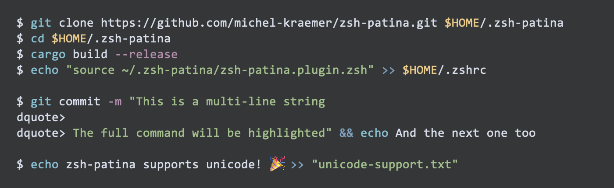

# zsh-patina

**$ A blazingly fast ZSH plugin performing syntax highlighting of your command line while you type 🌈**

The plugin spawns a small background daemon written in Rust. The daemon is shared between ZSH sessions and caches the syntax definition and color theme. Typical commands are highlighted in **less than a millisecond**. Extremely long commands only take a few milliseconds.

Internally, the plugin uses [syntect](https://github.com/trishume/syntect/), which provides **high-quality syntax highlighting** based on [Sublime Text](https://www.sublimetext.com/) syntax definitions. The built-in theme uses the eight ANSI colors and is compatible with all terminal emulators.

In contrast to other ZSH syntax highlighters (e.g. [zsh-syntax-highlighting](https://github.com/zsh-users/zsh-syntax-highlighting/) or [fast-syntax-highlighting](https://github.com/zdharma-continuum/fast-syntax-highlighting)), which use different colors to indicate whether a command or a directory/file exists, zsh-patina performs **static highlighting that solely depends on the characters you enter**. This way, you get a similar experience to editing code in your IDE.

## Examples



## How to install

**Prerequisites:** At the moment, there are no pre-compiled binaries. You have to build the plugin yourself. For this, you require [Rust](https://rust-lang.org/) 1.94.0 or higher. The easiest way to install Rust is through [rustup](https://rustup.rs/).

1. Clone the repository:

   ```shell
   git clone https://github.com/michel-kraemer/zsh-patina.git $HOME/.zsh-patina
   ```

2. Build the plugin:

   ```shell
   cd $HOME/.zsh-patina
   cargo build --release
   ```

3. Add the plugin to the end of your `.zshrc` file:

   ```shell
   echo "source ~/.zsh-patina/zsh-patina.plugin.zsh" >> $HOME/.zshrc
   ```

4. Restart your terminal, or run:

   ```shell
   exec zsh
   ```

## Configuration

zsh-patina can be configured through an optional configuration file at `~/.config/zsh-patina/config.toml`. If the file doesn't exist, the plugin uses the default settings shown below.

**Example configuration:**

```toml
[highlighting]
# For performance reasons, highlighting is disabled for very long lines. This
# option specifies the maximum length of a line (in bytes) up to which
# highlighting is applied.
max_line_length = 20000

# The maximum time (in milliseconds) to spend on highlighting a command. If
# highlighting takes longer, it will be aborted and the command will be
# partially highlighted.
#
# Note that the timeout only applies to multi-line commands. Highlighting cannot
# be aborted in the middle of a line. If you often deal with long lines that
# take longer to highlight than the timeout, consider reducing `max_line_length`.
timeout_ms = 500
```

After changing the configuration, restart the daemon with:

```shell
zsh-patina restart
```

## Theming

zsh-patina supports custom syntax highlighting themes. You can choose one of the built-in themes or create your own.

Note that after changing the `theme` setting or editing your custom theme file, as described [above](#configuration), you need to restart the daemon so the new colors are applied.

### Built-in themes

Set the `theme` option in your configuration file (`~/.config/zsh-patina/config.toml`):

```toml
[highlighting]
theme = "patina"
```

The following built-in themes are available:

| Theme | Description |
|-------|-------------|
| `patina` | The default theme with a balanced color palette |
| `simple` | A minimal theme with fewer colors |
| `lavender` | A variant with magenta/lavender tones |

To load a custom theme from a file, use the `file:` prefix:

```toml
[highlighting]
theme = "file:/path/to/mytheme.toml"
```

The path must be absolute.

### Creating a custom theme

A theme is a TOML file that maps **scopes** to **styles**. Each key is a scope name (note the quotation marks!) and each value is either a string denoting a foreground [color](#colors) or a [style](#styles). For example:

```toml
# comments
"comment" = "#a0a0a0"

# strings
"string" = "green"

# escape characters
"constant.character.escape" = "yellow"

# environment variables
"variable.other" = "yellow"
"punctuation.definition.variable" = "yellow"

# commands
"variable.function" = "cyan"

# keywords
"keyword" = { foreground = "blue", background = "red" }
```

### Colors

Colors can be specified as:

- One of the eight **ANSI colors**: `black`, `red`, `green`, `yellow`, `blue`, `magenta`, `cyan`, `white`
- A **hex color** in the format `#RRGGBB` (e.g. `"#a0a0a0"`) or `#RGB` (e.g. `"#f00"`)

ANSI color names use your terminal's color scheme, so the actual appearance depends on your terminal configuration. Hex colors are displayed as true colors (24-bit) if your terminal supports them.

### Styles

A style is a struct with a foreground color and a background color. For example:

```toml
"keyword" = { foreground = "blue", background = "red" }
```

### Scopes

Scopes follow the [Sublime Text scope naming convention](https://www.sublimetext.com/docs/scope_naming.html). A scope like `keyword` matches all keyword-related tokens (e.g. `keyword.control.for.shell`, `keyword.operator`). More specific scopes take precedence over general ones.

To list all available scopes, run:

```shell
zsh-patina list-scopes
```

You can also use the `tokenize` subcommand to inspect which scopes are assigned to parts of a command:

```shell
echo 'for i in 1 2 3; do echo $i; done' | zsh-patina tokenize
```

## How to remove the plugin

In the unlikely case you don't like zsh-patina ☹️, you can remove it as follows (note that these instructions assume you've installed the plugin in `$HOME/.zsh-patina`):

1. Remove the `source ~/.zsh-patina/zsh-patina.plugin.zsh` line from your `.zshrc`.
2. Restart the terminal
3. Stop the daemon:

   ```shell
   zsh-patina stop
   ```

4. Delete the directory where `zsh-patina` is installed:

   ```shell
   rm -rf $HOME/.zsh-patina
   ```

5. Delete the plugin's data directory:

   ```shell
   rm -rf $HOME/.local/share/zsh-patina/
   ```

6. If you have created a [configuration](#configuration) file, you may also want to delete the configuration directory:

   ```shell
   rm -rf $HOME/.config/zsh-patina/
   ```

## Contribute

I mostly built the plugin for myself because I wasn't satisfied with existing solutions (in terms of accuracy and performance). It doesn't have many features and is not particularly [configurable](#configuration) yet. It does one job, and it does it well IMHO.

If you like the plugin and want to add a feature or found a bug, feel free to contribute. **Issue reports and pull requests are more than welcome!**

## License

zsh-patina is released under the **MIT license**. See the [LICENSE](LICENSE) file
for more information.
